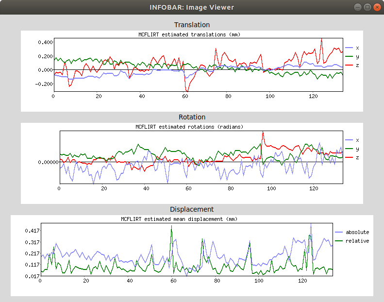
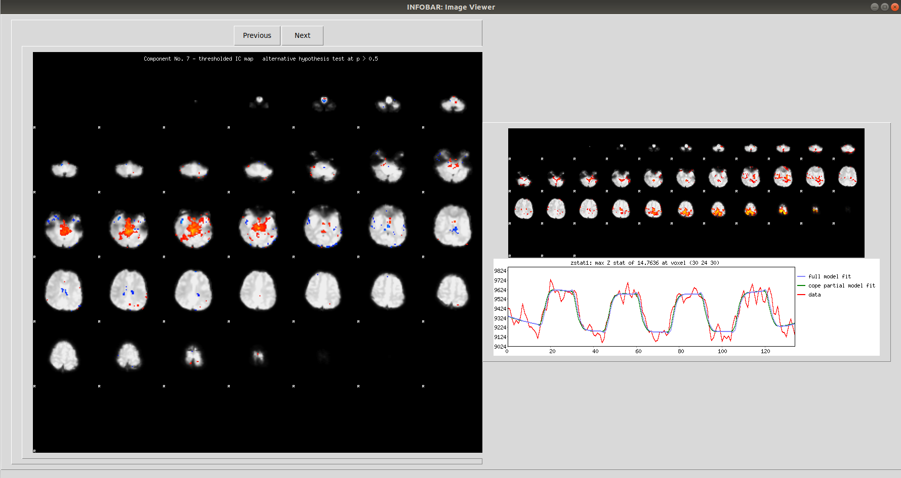
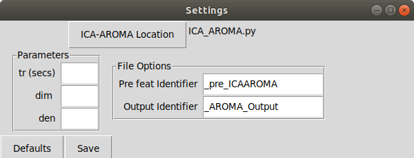

INFOBAR is a GUI tool to impletment ICA-AROMA, especially useful for processing large datasets and performing quality checks on the data.

## Installation

1. Extract contents of INFOBAR.zip to the local ICA-AROMA-master folder (The original ICA-AROMA program can be downloaded [here](https://github.com/maartenmennes/ICA-AROMA).). 
2. Alternatively, extract the contents to any desired location. Upon first run, go to Settings and select the location to `ICA_AROMA.py` in the panel, then click save. This will save the default configuration.

Python modules required: tkinter , bs4, statistics, futures, json, threading 

If running the program produces en error on missing modules (eg  `ModuleNotFoundError: No module named <Module_Name>`), simply install that module using the following command:

`pip install <module_name>` (eg, `pip install bs4 futures` for missing bs4 and futures module). 

## Usage

The software is written in Python 3 and can be launched from a bash prompt. To start the software, open up a terminal and type: 

`python3 <path_to_file>/INFOBAR.py`

The software searches for `.feat` folders generated after pre-pocessing through FSL. 

In the main window, there are options to select the Database location, Search using task/dataset names, and Filter using additional strings.

1. To start, click the `Database` button and selecting the root directory of your database.

2. Click `Search` to search for all .feat folders in the root directory.
    
3. Type in a task name and click `Search` to search for a specific task/dataset name.
4. Type in filters to narrow search based on subjects/ groups etc.
5. To process all  subjects shown in the display panel, click `Process`.
6. Alternatively, select the datasets to be processed. Press `ctrl` to select multiple datasets. Click `Process` to process selected subjects. Click `Clear` to clear selection. 
7. Left click on a dataset to view *MCFLIRT rotation*, *translation* and *displacement* plots.

8. Right click on a dataset to scroll through the independent components associated with motion identified by the algorithm.
9. If the data has been post processed *zstat1 lightbox image* and *peak voxel activation model fit*. will also be shown.

       
## Preprocessing steps
INFOBAR requires the data to be processed through FSL. Preprocessing involves:
1. Motion correction
2. 4D mean intensity normalization
3. Spatial smoothing (6mm FWHM)

## Settings

ICA-AROMA provides options to change the default TR, dimensionality reductions and de-noising techniques. The functionality is available here through a settings panel where the following user defined settings can be set.:
1. ICA-AROMA location: Select the location of the ICA_AROMA.py file from the original program. Default location is installation directory.
2.	Parameters for ICA-AROMA:
	1. tr (secs): TR in seconds. If this is not specified, the TR will be extracted from the header of the fMRI file using ‘fslinfo’. In that case, make sure the TR in the header is correct!
	2. 	dim:  Dimensionality reduction into a defined number of dimensions when running MELODIC (default is 0; automatic estimation)
	3. 	den: Type of denoising strategy (default is nonaggr): no: only classification, no denoising nonaggr: non-aggresssive denoising, i.e. partial component regression (default) aggr: aggressive denoising, i.e. full component regression both: both aggressive and non-aggressive denoising (two outputs)
3.	File Options:
a.	Pre feat Identifier:  If the preprocessed files are stored with a unique keyword identifier for record keeping, this keyword can be specified here. This keyword will be replaced by the Output Identifier keyword. If the keyword is not found, the folder name will simply be augmented with the Output Identifier. Default value is ‘_pre_ICAAROMA’
b.	Output Identifier: Keyword to replace Pre feat identifier. Default value is ‘_AROMA_Output’.

 Settings tab also allows the user to select the location of the ICA-AROMA program file for function call. The settings are saved in a JSON file. 
